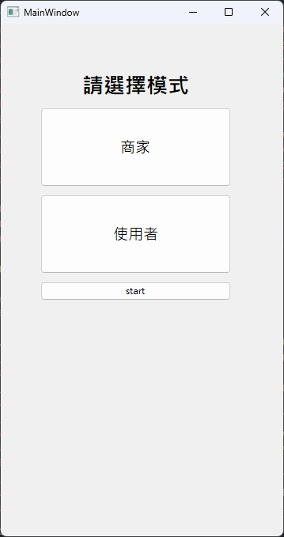

# ReviewAPP

Develop with PyQt5

[pyside2 for android development](https://stackoverflow.com/questions/70907303/pyside2-for-android-development)

## App interface


## Database implementation

[Google CloudSQL](./guide%20to%20test%20CloudSQL.md)

## Issue and work-around

1. open pyside6-designer on macOS in a virtual environment
    ```
    open .venv/lib/python3.9/site-packages/PySide6/Designer.app 
    ```

2. generate python code from ui files
    ```
    pyuic5.exe -x ./Src/uifiles.ui -o ouput.py
    ```